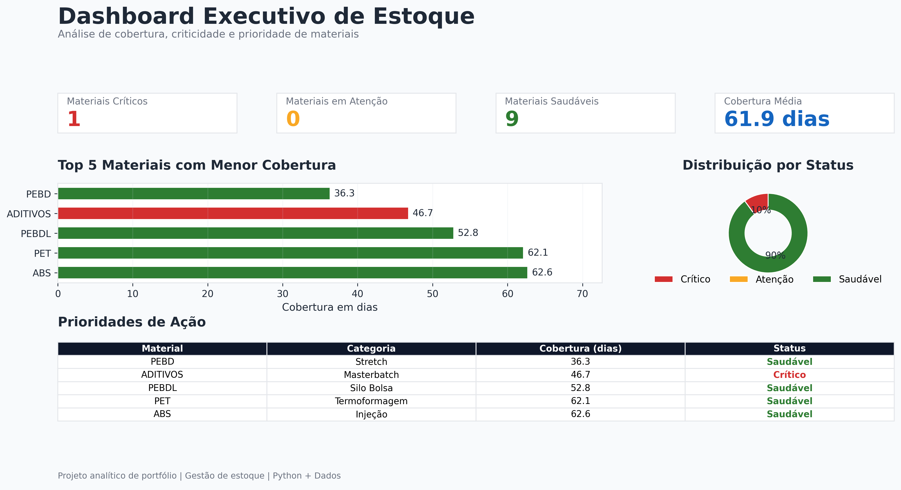

# Dashboard Inteligente de Estoque



Projeto analítico desenvolvido em **Python** com foco em **gestão de estoque**, **priorização de materiais** e **suporte à tomada de decisão** por meio de indicadores estratégicos e visualizações executivas.

---

## Visão Geral

Este projeto simula um cenário industrial em que diferentes materiais precisam ser monitorados continuamente com base em variáveis operacionais críticas:

- Consumo histórico  
- Estoque disponível  
- Lead time de reposição  
- Estoque de segurança  
- Cobertura em dias  
- Criticidade operacional  

A partir desses dados, o sistema identifica riscos de abastecimento, prioriza materiais e gera relatórios gerenciais automaticamente.

---

## Objetivo de Negócio

Apoiar áreas de Supply Chain, Compras e Planejamento na tomada de decisão, reduzindo risco de ruptura e aumentando previsibilidade operacional.

---

## Principais Entregas

### Dashboard Executivo (PNG)

Painel visual gerado automaticamente contendo:

- Indicadores principais
- Quantidade de materiais críticos
- Cobertura média em dias
- Ranking de prioridades
- Distribuição por status
- Tabela de ação prioritária

### Relatório Executivo (PDF)

Documento gerencial estruturado com:

- Resumo analítico
- Principais achados
- Recomendações estratégicas
- Painel visual consolidado

### Base Analítica (CSV)

Arquivo consolidado com métricas calculadas para todos os materiais.

---

## Tecnologias Utilizadas

- Python  
- Pandas  
- Matplotlib  
- FPDF2  
- CSV  

---

## Estrutura do Projeto

```text
dashboard-estoque-inteligente/
├── data/
│   ├── estoque_atual.csv
│   └── consumo_historico.csv
│
├── outputs/
│   ├── analise_estoque.csv
│   ├── dashboard_estoque.png
│   └── relatorio_estoque.pdf
│
├── src/
│   ├── preprocess.py
│   ├── metrics.py
│   ├── visualize.py
│   ├── report.py
│   └── main.py
│
├── requirements.txt
└── README.md
